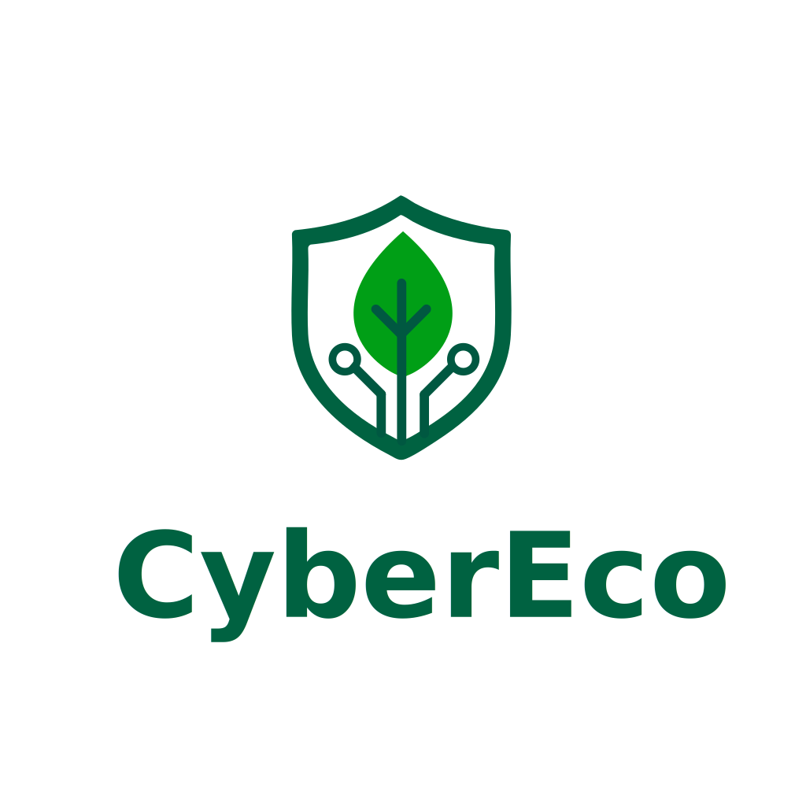

# CyberEco Homepage


[](https://codecov.io/gh/cyber-eco/cybereco)

## 🌱 Overview

The CyberEco Homepage is a modern, responsive React application that serves as the primary web presence for CyberEco. This project showcases CyberEco's mission of developing innovative digital applications that enhance financial collaboration, community engagement, and social connectivity through user-centered design.

<p align="center">
  
</p>

## 🚀 Features

- **Responsive Design**: Optimized for all device sizes from mobile to desktop
- **Multi-language Support**: Full internationalization with English and Spanish support
- **Dark/Light Mode**: User-selectable theme preference with system detection
- **Animated UI**: Smooth transitions and animations using Framer Motion
- **Accessible**: Built with accessibility in mind
- **SEO Optimized**: Structured for search engine visibility

## 📱 Solutions Showcase

The homepage showcases CyberEco's innovative applications:

- **JustSplit**: A simple and intuitive expense tracking and sharing app
- **Plantopia**: Smart gardening platform combining IoT with plant care knowledge
- **Demos**: Smart democracy platform for transparent decision-making processes
- **Nexus**: Integrated social media hub for managing multiple platforms
- **TradePilot**: Advanced trading tool with analytics and automation
- **Community Manager**: Platform to create, grow, and manage communities

## 💻 Technology Stack

- **React**: UI library for building the user interface
- **TypeScript**: Type-safe JavaScript for improved developer experience
- **React Router**: For handling navigation and routing
- **Styled Components**: CSS-in-JS for component styling
- **Framer Motion**: Animation library for React
- **React Icons**: Icon library for React applications
- **Context API**: For state management (theme, language)

## 🔧 Installation & Setup

1. **Clone the repository**
   ```bash
   git clone https://github.com/cyber-eco/cybereco.git
   cd cybereco/homepage
   ```

2. **Install dependencies**
   ```bash
   npm install
   ```

3. **Start development server**
   ```bash
   npm start
   ```

4. **Build for production**
   ```bash
   npm run build
   ```

5. **Run tests**
   ```bash
   npm test
   ```

## 📁 Project Structure

```
/homepage
├── public/                  # Static assets
│   ├── logo.svg
│   ├── logo-rectangle.svg
│   └── portfolio/           # Product images
├── src/
│   ├── components/          # Reusable UI components
│   │   ├── common/          # Shared components (Button, Logo, etc.)
│   │   ├── home/            # Homepage-specific components
│   │   └── layout/          # Layout components (Header, Footer)
│   ├── context/             # React Context providers
│   │   ├── LanguageContext.tsx
│   │   └── ThemeContext.tsx
│   ├── pages/               # Page components
│   ├── styles/              # Global styles and themes
│   ├── translations/        # i18n translation files
│   ├── types/               # TypeScript type definitions
│   ├── App.tsx              # Application entry point
│   └── index.tsx            # React rendering entry point
└── README.md                # Project documentation
```

## 🌈 Core Values

CyberEco is guided by four fundamental values:

- **Innovation with Purpose**: Creating technology that solves real problems
- **Environmental Stewardship**: Designing solutions with sustainability in mind
- **User-Centered Design**: Prioritizing intuitive and accessible experiences
- **Collaborative Growth**: Building communities where everyone can thrive together

## 🔄 Continuous Integration

This project uses GitHub Actions for CI/CD:
- Automated builds on every push
- Test suite execution
- Code coverage reporting

## 📄 License

Copyright © 2023 CyberEco. All rights reserved.


## 📞 Contact

For questions or support, please contact us at info@cybere.co

---

<p align="center">
  Made with ❤️ by CyberEco
</p>