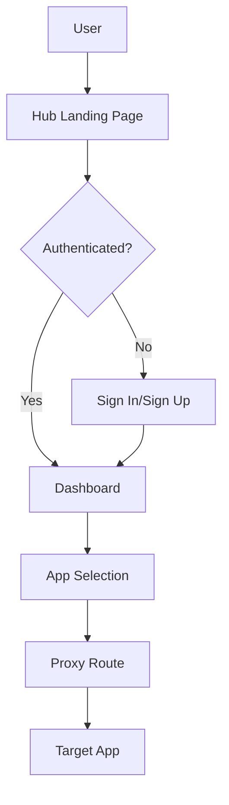

# CyberEco Hub Documentation

## Overview

CyberEco Hub is the central authentication and application gateway for the entire CyberEco ecosystem. It provides:

- **Unified Authentication**: Single sign-on (SSO) for all CyberEco applications
- **Application Proxy**: Seamless routing between ecosystem apps
- **User Management**: Centralized profile and settings management
- **Security Gateway**: Enterprise-grade security features

## Architecture

### Key Components

1. **Authentication Service**
   - Firebase Auth integration
   - OAuth2 providers (Google, GitHub, etc.)
   - Multi-factor authentication (MFA)
   - Session management

2. **Proxy Layer**
   - Next.js middleware for request routing
   - App-specific rewrites
   - Security headers injection
   - CORS handling

3. **User Interface**
   - Modern landing page for new users
   - Dashboard for authenticated users
   - App launcher grid
   - Profile management

### Application Flow



## Features

### For Users

- **Single Sign-On**: One account for all apps
- **App Discovery**: Browse and access ecosystem applications
- **Profile Management**: Centralized user settings
- **Security Controls**: 2FA, session management, activity logs

### For Developers

- **Authentication API**: RESTful endpoints for auth operations
- **Proxy Configuration**: Easy app integration
- **Security Middleware**: Built-in protection
- **Monitoring**: Real-time analytics and logs

## Proxy Configuration

The Hub acts as a reverse proxy for ecosystem applications:

### Route Mapping

| Route Pattern | Target App | Port | Status |
|--------------|------------|------|--------|
| `/app/justsplit/**` | JustSplit | 40002 | Live |
| `/app/website/**` | Website | 40001 | Live |
| `/app/somos/**` | Somos | 40003 | Coming Soon |
| `/app/demos/**` | Demos | 40004 | Coming Soon |
| `/app/plantopia/**` | Plantopia | 40005 | Coming Soon |

### Adding New Apps

1. Update `next.config.js` rewrites:
```javascript
{
  source: '/app/newapp/:path*',
  destination: 'http://localhost:PORT/:path*',
}
```

2. Add to middleware configuration in `src/middleware.ts`
3. Update app registry in landing page

## Security

### Headers

All responses include security headers:
- `X-Frame-Options: DENY`
- `X-Content-Type-Options: nosniff`
- `Referrer-Policy: strict-origin-when-cross-origin`
- `Permissions-Policy: camera=(), microphone=(), geolocation=()`

### Authentication Flow

1. User accesses Hub
2. Redirected to sign-in if not authenticated
3. Firebase Auth handles authentication
4. JWT token stored in secure cookie
5. Token validated on each request
6. Cross-app authentication via shared session

## Development

### Local Setup

```bash
# Navigate to Hub directory
cd apps/hub

# Install dependencies
npm install

# Start development server
nx serve hub

# Access at http://localhost:40000
```

### Environment Variables

```env
NEXT_PUBLIC_FIREBASE_API_KEY=xxx
NEXT_PUBLIC_FIREBASE_AUTH_DOMAIN=xxx
NEXT_PUBLIC_FIREBASE_PROJECT_ID=xxx
NEXT_PUBLIC_HUB_URL=http://localhost:40000
```

### Testing

```bash
# Run unit tests
nx test hub

# Run integration tests
nx e2e hub-e2e

# Test proxy functionality
npm run test:proxy
```

## Deployment

### Firebase Hosting

1. Build the application:
```bash
nx build hub --configuration=production
```

2. Deploy to Firebase:
```bash
cd firebase/hub
firebase deploy --only hosting
```

### Docker (Alternative)

```dockerfile
FROM node:18-alpine
WORKDIR /app
COPY . .
RUN npm ci --only=production
RUN npm run build
EXPOSE 40000
CMD ["npm", "start"]
```

## API Reference

### Authentication Endpoints

| Endpoint | Method | Description |
|----------|--------|-------------|
| `/api/auth/login` | POST | User login |
| `/api/auth/logout` | POST | User logout |
| `/api/auth/refresh` | POST | Refresh token |
| `/api/auth/verify` | GET | Verify session |

### User Management

| Endpoint | Method | Description |
|----------|--------|-------------|
| `/api/user/profile` | GET | Get user profile |
| `/api/user/profile` | PUT | Update profile |
| `/api/user/settings` | GET | Get settings |
| `/api/user/settings` | PUT | Update settings |

## Troubleshooting

### Common Issues

1. **Proxy not working**
   - Check target app is running
   - Verify port configuration
   - Check middleware logs

2. **Authentication failures**
   - Verify Firebase configuration
   - Check cookie settings
   - Review CORS policy

3. **Performance issues**
   - Enable caching headers
   - Use CDN for static assets
   - Optimize bundle size

## Contributing

See [CONTRIBUTING.md](/docs/development/contributing.md) for general guidelines.

### Hub-Specific Guidelines

1. Maintain backwards compatibility for auth APIs
2. Test proxy routes thoroughly
3. Document security implications
4. Follow accessibility standards

## Related Documentation

- [Architecture Overview](/docs/architecture/overview.md)
- [Security Guidelines](/docs/operations/security/compliance-framework.md)
- [Firebase Configuration](/docs/deployment/firebase-deployment.md)
- [Testing Strategy](/docs/development/testing/testing-strategy.md)