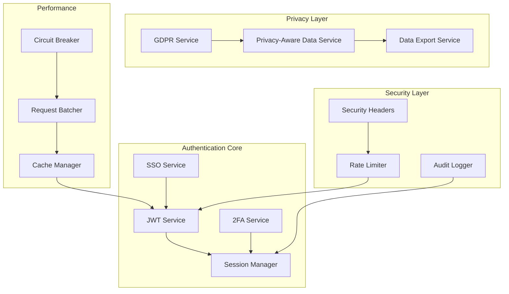

# Authentication Enhancements Documentation

## Overview

This document details the comprehensive authentication system enhancements implemented in the CyberEco platform, including JWT authentication, SSO integration, rate limiting, two-factor authentication, session management, and GDPR compliance features.

## Architecture Overview



## Core Services

### 1. JWT Authentication Service

**Location**: `/libs/auth/src/services/jwtService.ts`

**Features**:
- HS256 algorithm for token signing
- 24-hour token expiration with 7-day refresh tokens
- Automatic token refresh mechanism
- Secure token storage and validation

**Key Methods**:
```typescript
generateTokens(userId: string): Promise<TokenPair>
verifyAccessToken(token: string): Promise<DecodedToken>
refreshTokens(refreshToken: string): Promise<TokenPair>
revokeTokens(userId: string): Promise<void>
```

### 2. Single Sign-On (SSO) Service

**Location**: `/libs/auth/src/services/ssoService.ts`

**Features**:
- Cross-application authentication
- Domain-based token sharing
- Session synchronization
- Secure redirect flow

**Integration Points**:
- Hub: Central authentication authority
- JustSplit: Consumer application
- Website: Marketing site with optional auth

### 3. Rate Limiting Middleware

**Location**: `/apps/hub/src/middleware/rateLimiter.ts`

**Configuration**:
```typescript
const limits = {
  global: { windowMs: 15 * 60 * 1000, max: 100 },
  auth: { windowMs: 15 * 60 * 1000, max: 5 },
  api: { windowMs: 1 * 60 * 1000, max: 30 }
}
```

**Features**:
- Redis-backed distributed rate limiting
- Fallback to in-memory store
- Per-endpoint configuration
- Rate limit headers in responses

### 4. Two-Factor Authentication

**Location**: `/libs/auth/src/services/twoFactorService.ts`

**Implementation**:
- TOTP (Time-based One-Time Password) algorithm
- QR code generation for easy setup
- Backup codes for recovery
- Device trust management

**Security Parameters**:
- Algorithm: SHA-1
- Digits: 6
- Period: 30 seconds
- Secret Length: 32 bytes

### 5. Session Management

**Location**: `/libs/auth/src/services/sessionService.ts`

**Features**:
- Multi-device session tracking
- Geolocation and device fingerprinting
- Session invalidation controls
- Activity monitoring

**Session Data Structure**:
```typescript
interface Session {
  sessionId: string;
  userId: string;
  deviceInfo: DeviceInfo;
  createdAt: Date;
  lastActivity: Date;
  expiresAt: Date;
  ipAddress: string;
  userAgent: string;
  location?: GeolocationData;
}
```

### 6. Security Headers Middleware

**Location**: `/apps/hub/src/middleware/securityHeaders.ts`

**Headers Applied**:
```typescript
X-Content-Type-Options: nosniff
X-Frame-Options: DENY
X-XSS-Protection: 1; mode=block
Strict-Transport-Security: max-age=31536000; includeSubDomains
Content-Security-Policy: [comprehensive policy]
Referrer-Policy: strict-origin-when-cross-origin
```

### 7. Audit Dashboard

**Location**: `/apps/hub/src/app/security/audit/page.tsx`

**Features**:
- Real-time security event monitoring
- Login patterns visualization
- Failed attempt tracking
- Suspicious activity detection
- Export audit logs

### 8. GDPR Compliance Service

**Location**: `/libs/auth/src/services/gdprService.ts`

**Implemented Rights**:
- Right to Access (data export)
- Right to Erasure (account deletion)
- Right to Data Portability
- Right to Rectification
- Consent Management

**Consent Types**:
```typescript
enum ConsentType {
  NECESSARY = 'necessary',
  FUNCTIONAL = 'functional',
  ANALYTICS = 'analytics',
  MARKETING = 'marketing',
  PERSONALIZATION = 'personalization'
}
```

### 9. Privacy-Aware Data Service

**Location**: `/libs/auth/src/services/privacyAwareDataService.ts`

**Features**:
- Automatic data filtering based on privacy settings
- Relationship-based access control
- Data anonymization
- Audit logging for data access

**Privacy Levels**:
```typescript
type VisibilityLevel = 'everyone' | 'friends' | 'only-me';

interface PrivacySettings {
  profileVisibility: VisibilityLevel;
  activityVisibility: {
    expenses: VisibilityLevel;
    groups: VisibilityLevel;
    settlements: VisibilityLevel;
  };
}
```

### 10. Data Export Service

**Location**: `/libs/auth/src/services/dataExportService.ts`

**Export Formats**:
- JSON (hierarchical, preserves relationships)
- CSV (flattened, spreadsheet-compatible)

**Features**:
- Chunked processing for large datasets
- Rate limiting (5 exports per 24 hours)
- Secure download links (30-minute expiration)
- Comprehensive metadata inclusion

### 11. Performance Optimization

**Cache Service** (`/libs/auth/src/services/cacheService.ts`):
- Multi-tier caching (memory + Redis)
- TTL-based expiration
- Cache warming strategies
- Invalidation patterns

**Request Batcher** (`/libs/auth/src/services/requestBatcher.ts`):
- Automatic request batching
- Configurable batch size and delay
- Error handling per request
- Performance metrics

**Circuit Breaker** (`/libs/auth/src/utils/circuitBreaker.ts`):
- Automatic failure detection
- Exponential backoff
- Health check probing
- State transitions (closed → open → half-open)

### 12. Error Recovery

**Patterns Implemented**:
- Retry with exponential backoff
- Circuit breaker for external services
- Graceful degradation
- User-friendly error messages

## API Endpoints

### Authentication Endpoints

| Endpoint | Method | Description |
|----------|--------|-------------|
| `/api/auth/signin` | POST | Sign in with email/password |
| `/api/auth/signup` | POST | Create new account |
| `/api/auth/signout` | POST | Sign out current session |
| `/api/auth/refresh` | POST | Refresh access token |
| `/api/auth/verify-2fa` | POST | Verify 2FA code |
| `/api/auth/sessions` | GET | List active sessions |
| `/api/auth/sessions/:id` | DELETE | Revoke specific session |

### Privacy Endpoints

| Endpoint | Method | Description |
|----------|--------|-------------|
| `/api/privacy/settings` | GET | Get privacy settings |
| `/api/privacy/settings` | PUT | Update privacy settings |
| `/api/privacy/consent` | POST | Record consent |
| `/api/privacy/consent` | GET | Get consent status |

### Data Export Endpoints

| Endpoint | Method | Description |
|----------|--------|-------------|
| `/api/export` | POST | Request data export |
| `/api/export/status/:id` | GET | Check export status |
| `/api/export/download/:id` | GET | Download export file |

### GDPR Endpoints

| Endpoint | Method | Description |
|----------|--------|-------------|
| `/api/gdpr/request-deletion` | POST | Request account deletion |
| `/api/gdpr/privacy-report` | GET | Generate privacy report |
| `/api/gdpr/data-portability` | POST | Request data portability |

## Security Considerations

### Token Security
- Tokens stored in httpOnly cookies
- Secure flag enabled in production
- SameSite=Strict for CSRF protection
- Regular token rotation

### Rate Limiting Strategy
- Progressive delays for repeated failures
- IP-based tracking with user account correlation
- Whitelist for trusted IPs
- Configurable thresholds per endpoint

### 2FA Implementation
- Time synchronization tolerance (±1 window)
- Backup codes stored hashed
- Device trust for 30 days
- Rate limiting on verification attempts

### Privacy by Design
- Minimal data collection
- Purpose limitation
- Data minimization
- Consent before processing
- Audit trail for all data access

## Monitoring and Observability

### Metrics Collected
- Authentication success/failure rates
- Token refresh patterns
- 2FA adoption rate
- Session duration statistics
- Privacy setting distributions
- Data export request volumes

### Audit Events
```typescript
enum AuditEventType {
  LOGIN_SUCCESS = 'login_success',
  LOGIN_FAILURE = 'login_failure',
  LOGOUT = 'logout',
  PASSWORD_CHANGE = 'password_change',
  TWO_FACTOR_ENABLED = 'two_factor_enabled',
  TWO_FACTOR_DISABLED = 'two_factor_disabled',
  PRIVACY_SETTINGS_CHANGED = 'privacy_settings_changed',
  DATA_EXPORTED = 'data_exported',
  ACCOUNT_DELETED = 'account_deleted',
  SUSPICIOUS_ACTIVITY = 'suspicious_activity'
}
```

### Alert Triggers
- Multiple failed login attempts
- Unusual login locations
- Rapid session creation
- Mass data export requests
- Circuit breaker activations

## Testing Strategy

### Unit Tests
- Service method validation
- Edge case handling
- Error scenario coverage
- Mock external dependencies

### Integration Tests
- End-to-end authentication flows
- Cross-service interactions
- Database transaction integrity
- API endpoint validation

### Security Tests
- Token validation edge cases
- Rate limit boundary testing
- 2FA timing attack prevention
- Privacy filter accuracy

### Performance Tests
- Cache hit rates
- Batch processing efficiency
- Circuit breaker thresholds
- Response time benchmarks

## Migration Guide

### Enabling 2FA for Existing Users
1. Deploy 2FA service
2. Add UI components
3. Run migration to add 2FA fields
4. Enable feature flag
5. Prompt users on next login

### Implementing Privacy Controls
1. Deploy privacy services
2. Set default privacy settings
3. Show consent banner
4. Migrate existing data permissions
5. Enable privacy filtering

### Rate Limiting Rollout
1. Deploy in monitoring mode
2. Analyze traffic patterns
3. Set appropriate thresholds
4. Enable enforcement
5. Monitor for false positives

## Future Enhancements

### Planned Features
- WebAuthn/Passkey support
- Risk-based authentication
- Anomaly detection ML models
- Delegated authorization
- Federated identity support

### Performance Improvements
- Edge caching for JWT validation
- Distributed session storage
- Async audit logging
- Database query optimization
- CDN integration for static assets

### Privacy Enhancements
- Differential privacy for analytics
- Homomorphic encryption
- Zero-knowledge proofs
- Decentralized identity
- Privacy-preserving ML

## Troubleshooting

### Common Issues

**JWT Token Expiration**:
- Symptom: 401 errors after 24 hours
- Solution: Implement automatic token refresh
- Prevention: Monitor refresh token usage

**Rate Limit False Positives**:
- Symptom: Legitimate users blocked
- Solution: Adjust thresholds or whitelist
- Prevention: Analyze usage patterns

**2FA Time Sync Issues**:
- Symptom: Valid codes rejected
- Solution: Increase time window tolerance
- Prevention: NTP synchronization

**Privacy Filter Performance**:
- Symptom: Slow query responses
- Solution: Add database indexes
- Prevention: Implement caching layer

## References

- [JWT RFC 7519](https://tools.ietf.org/html/rfc7519)
- [TOTP RFC 6238](https://tools.ietf.org/html/rfc6238)
- [GDPR Official Text](https://gdpr-info.eu/)
- [OWASP Authentication Cheatsheet](https://cheatsheetseries.owasp.org/cheatsheets/Authentication_Cheat_Sheet.html)
- [Security Headers Best Practices](https://securityheaders.com/)