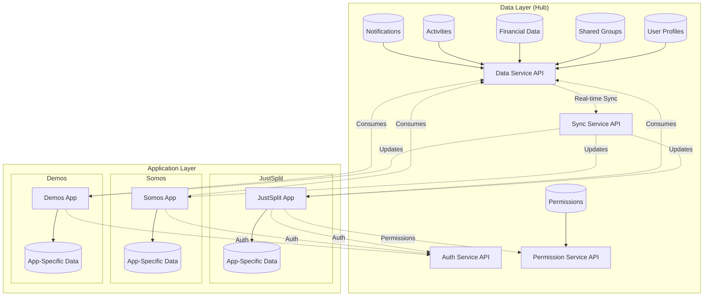

# Data Layer Architecture

## Overview

CyberEco implements a centralized data layer architecture where the Hub serves as the single source of truth for shared data, while individual applications maintain their app-specific data and consume shared data through well-defined APIs.

## Architecture Diagram



## Core Concepts

### 1. Centralized Data Layer (Hub)

The Hub maintains centralized data that is shared across applications:

- **User Profiles**: Core user information, preferences, and settings
- **Permissions**: App access controls and feature flags
- **Financial Data**: Shared transactions, budgets, and accounts
- **Groups**: Cross-app group memberships and relationships
- **Activities**: Events and activities that span multiple apps
- **Notifications**: Centralized notification system

### 2. Application Layer

Each application:
- Maintains its own app-specific data
- Consumes shared data from Hub via APIs
- Can contribute data back to the shared layer
- Operates independently while staying synchronized

### 3. Data Flow Patterns

#### Read Flow
```
App → Request Data → Hub API → Validate Permissions → Return Data → App Cache → Display
```

#### Write Flow
```
App → Submit Data → Hub API → Validate → Store in Hub → Broadcast Update → Sync to Apps
```

#### Real-time Sync
```
Hub Data Change → WebSocket/Firebase → Push to Subscribed Apps → Update Local State
```

## Implementation Details

### Data Models

#### Shared Data (Hub)

```typescript
// User Profile - Centralized in Hub
interface SharedUserProfile {
  id: string;
  name: string;
  email?: string;
  avatarUrl?: string;
  preferences: UserPreferences;
  appData: {
    [appId: string]: {
      profileId: string;
      lastAccessed: string;
    };
  };
}

// Financial Transaction - Shared across finance apps
interface Transaction {
  id: string;
  userId: string;
  amount: number;
  currency: string;
  date: string;
  appId: string; // Which app created it
  appSpecificId?: string; // Link to app data
}

// Shared Group - Used across multiple apps
interface SharedGroup {
  id: string;
  name: string;
  members: GroupMember[];
  appContexts: {
    [appId: string]: {
      groupId: string;
      features: string[];
    };
  };
}
```

#### App-Specific Data

```typescript
// JustSplit Expense - App-specific extension
interface JustSplitExpense {
  id: string;
  transactionId: string; // Links to shared transaction
  splitMethod: 'equal' | 'custom';
  participants: Participant[];
  receipts: string[];
  // JustSplit-specific fields
}

// Somos Memory - App-specific data
interface SomosMemory {
  id: string;
  activityId: string; // Links to shared activity
  familyTreeId: string;
  mediaUrls: string[];
  tags: string[];
  // Somos-specific fields
}
```

### API Structure

#### Data Service API

```typescript
class HubDataService {
  // User Operations
  async getUserProfile(userId: string): Promise<SharedUserProfile>
  async updateUserProfile(userId: string, updates: Partial<SharedUserProfile>): Promise<void>
  
  // Transaction Operations
  async createTransaction(transaction: Transaction): Promise<string>
  async getUserTransactions(userId: string, filters?: TransactionFilters): Promise<Transaction[]>
  
  // Group Operations
  async createSharedGroup(group: SharedGroup): Promise<string>
  async getUserGroups(userId: string): Promise<SharedGroup[]>
  async addGroupMember(groupId: string, member: GroupMember): Promise<void>
  
  // Real-time Subscriptions
  subscribeToUserData(userId: string, callback: (data: any) => void): Unsubscribe
  subscribeToGroupUpdates(groupId: string, callback: (updates: any) => void): Unsubscribe
}
```

#### App Integration

```typescript
// In JustSplit
class JustSplitDataLayer {
  private hubData: HubDataService;
  private localCache: LocalCache;
  
  async createExpense(expense: ExpenseInput): Promise<void> {
    // 1. Create shared transaction in Hub
    const transactionId = await this.hubData.createTransaction({
      userId: expense.paidBy,
      amount: expense.amount,
      currency: expense.currency,
      date: expense.date,
      appId: 'justsplit'
    });
    
    // 2. Store app-specific data locally
    await this.localCache.saveExpense({
      ...expense,
      transactionId,
      splitDetails: expense.splits
    });
    
    // 3. Notify group members
    await this.hubData.notifyGroup(expense.groupId, {
      type: 'new_expense',
      data: { transactionId, expenseId: expense.id }
    });
  }
}
```

## Benefits

### For Users

1. **Single Source of Truth**: Profile changes reflect everywhere instantly
2. **Cross-App Insights**: See financial data across all apps in one place
3. **Unified Groups**: Same groups work across different apps
4. **Consistent Experience**: Settings and preferences carry over

### For Developers

1. **Reduced Complexity**: No need to sync user data between apps
2. **Reusable Components**: Shared data models and APIs
3. **Faster Development**: Focus on app-specific features
4. **Built-in Permissions**: Centralized access control

### For the Platform

1. **Scalability**: Add new apps without data migration
2. **Data Integrity**: Centralized validation and consistency
3. **Analytics**: Comprehensive cross-app analytics
4. **Maintenance**: Single point for data updates

## Data Privacy & Security

### Access Control

- Apps can only access data user has authorized
- Fine-grained permissions per data type
- Audit logs for all data access
- Encrypted data in transit and at rest

### Data Ownership

- Users own their data
- Can export all data anytime
- Can revoke app access
- Right to deletion (GDPR compliant)

## Migration Strategy

### For New Apps

1. Use shared auth from the start
2. Design data models to leverage shared types
3. Implement local caching for performance
4. Subscribe to real-time updates

### For Existing Apps

1. Map existing data to shared models
2. Implement gradual migration
3. Maintain backward compatibility
4. Provide migration tools for users

## Best Practices

### 1. Data Modeling

```typescript
// ✅ Good: Extend shared types
interface AppSpecificUser extends SharedUserProfile {
  appSpecificField: string;
}

// ❌ Bad: Duplicate shared fields
interface AppUser {
  id: string; // Duplicates SharedUserProfile
  name: string; // Duplicates SharedUserProfile
  appField: string;
}
```

### 2. Caching Strategy

```typescript
// ✅ Good: Cache with TTL and invalidation
class DataCache {
  private cache = new Map<string, CachedItem>();
  
  async get(key: string): Promise<any> {
    const cached = this.cache.get(key);
    if (cached && !this.isExpired(cached)) {
      return cached.data;
    }
    return this.fetchFromHub(key);
  }
}

// ❌ Bad: No cache invalidation
const cache = {};
function getData(key) {
  return cache[key] || fetchData(key);
}
```

### 3. Error Handling

```typescript
// ✅ Good: Graceful degradation
async function loadUserData(userId: string) {
  try {
    // Try to get fresh data from Hub
    return await hubApi.getUserProfile(userId);
  } catch (error) {
    // Fall back to cached data
    const cached = await localCache.get(`user:${userId}`);
    if (cached) {
      showNotification('Using cached data - updates may be delayed');
      return cached;
    }
    throw error;
  }
}
```

## Monitoring & Debugging

### Key Metrics

- API response times
- Cache hit rates
- Sync lag times
- Permission check performance
- Data consistency checks

### Debug Tools

```typescript
// Enable debug mode
localStorage.setItem('HUB_DATA_DEBUG', 'true');

// View cache state
window.__HUB_CACHE__.inspect();

// Force sync
window.__HUB_SYNC__.forceSync();

// View permission state
window.__HUB_PERMISSIONS__.check('app:feature');
```

## Future Enhancements

### Phase 1: Current Implementation
- Centralized auth and profiles
- Basic data sharing
- Permission system

### Phase 2: Enhanced Integration
- GraphQL API for efficient queries
- Offline-first architecture
- Advanced caching strategies

### Phase 3: Decentralization
- P2P data sync
- Local-first architecture
- Blockchain integration
- User-controlled data pods

## Conclusion

The Hub data layer architecture provides a solid foundation for building interconnected applications while maintaining data sovereignty and user privacy. By centralizing shared data and providing well-defined APIs, we enable rapid application development while ensuring consistency and security across the ecosystem.