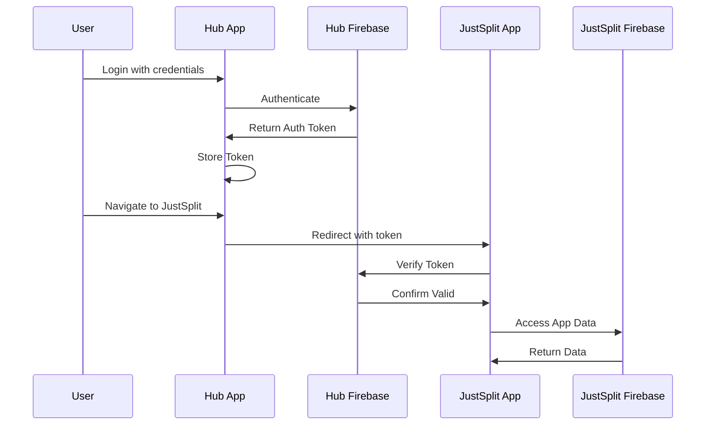

# CyberEco Platform - NX Monorepo Architecture

> **🏗️ Comprehensive monorepo architecture for the CyberEco platform, supporting multiple applications with shared libraries and optimized development workflow**

## Overview

The CyberEco platform has been architected as an NX monorepo to support multiple applications while sharing common libraries, infrastructure, and maintaining consistent development practices. This document outlines the complete architecture, including current and upcoming applications, libraries, and their relationships.

## Repository Structure

```
CyberEco/
├── apps/                          # Applications
│   ├── hub/                       # Hub application (authentication & app launcher)
│   │   ├── src/
│   │   │   ├── app/               # Next.js app router
│   │   │   ├── components/        # Hub-specific components
│   │   │   ├── lib/               # Hub utilities
│   │   │   └── services/          # Hub services
│   │   ├── project.json           # NX project configuration
│   │   ├── next.config.js         # Next.js configuration
│   │   └── package.json           # App-specific dependencies
│   │
│   ├── justsplit/                 # JustSplit application (expense splitting)
│   │   ├── src/
│   │   │   ├── app/               # Next.js app router
│   │   │   ├── components/        # JustSplit-specific components
│   │   │   ├── context/           # React contexts
│   │   │   ├── types/             # App-specific types
│   │   │   └── utils/             # JustSplit utilities
│   │   ├── project.json           # NX project configuration
│   │   ├── next.config.js         # Next.js configuration
│   │   └── package.json           # App-specific dependencies
│   │
│   ├── somos/                     # Somos application (planned - family roots explorer)
│   ├── demos/                     # Demos application (planned - community governance)
│   └── plantopia/                 # Plantopia application (planned - smart gardening)
│
├── libs/                          # Shared libraries
│   ├── shared-types/              # Platform-wide type definitions
│   │   ├── src/
│   │   │   ├── auth.ts            # Authentication types
│   │   │   ├── user.ts            # User types
│   │   │   ├── app.ts             # App types
│   │   │   └── index.ts           # Exports
│   │   └── project.json           # Library configuration
│   │
│   ├── firebase-config/           # Shared Firebase configuration
│   │   ├── src/
│   │   │   ├── config.ts          # Firebase setup
│   │   │   ├── auth.ts            # Authentication utilities
│   │   │   ├── firestore.ts       # Database utilities
│   │   │   └── index.ts           # Exports
│   │   └── project.json           # Library configuration
│   │
│   └── ui-components/             # Shared UI component library
│       ├── src/
│       │   ├── Button/            # Button components
│       │   ├── Card/              # Card components
│       │   ├── Alert/             # Alert components
│       │   ├── LoadingSpinner/    # Loading indicator components
│       │   └── index.ts           # Exports
│       └── project.json           # Library configuration
│
├── firebase/                      # Firebase configuration per app
│   ├── hub/                       # Hub Firebase config
│   │   ├── firebase.json
│   │   └── firestore.rules
│   ├── justsplit/                 # JustSplit Firebase config
│   │   ├── firebase.json
│   │   └── firestore.rules
│   └── future-apps/               # Templates for future app configs
│
├── scripts/                       # Deployment and utility scripts
│   ├── deploy-all.sh
│   ├── deploy-hub.sh
│   └── deploy-justsplit.sh
│
├── docs/                          # Documentation
├── nx.json                        # NX workspace configuration
├── tsconfig.base.json             # Base TypeScript configuration
└── package.json                   # Root dependencies
```

## Current Applications

### Hub App (`apps/hub`)

**Purpose**: Central authentication and application management system

**Technology Stack**:
- Next.js with App Router
- TypeScript
- Firebase Auth
- CSS Modules

**Key Responsibilities**:
- User authentication and authorization
- Application registry and management
- User preferences and settings
- Cross-app navigation
- Role-based access control

**Key Features**:
- Single sign-on for all platform apps
- Application discovery and access
- User profile management
- Permission management
- Platform-wide notifications

**Dependencies**:
- `@cybereco/shared-types`
- `@cybereco/firebase-config`
- `@cybereco/ui-components`

### JustSplit App (`apps/justsplit`)

**Purpose**: Core expense splitting and financial management application

**Technology Stack**:
- Next.js with App Router
- TypeScript
- Firebase Firestore
- CSS Modules
- Chart.js for visualizations

**Key Responsibilities**:
- Expense creation and management
- Group and event organization
- Financial calculations and splitting
- Settlement tracking
- Real-time collaboration

**Key Features**:
- Multi-currency expense tracking
- Various splitting methods (equal, percentage, custom)
- Group and event management
- Settlement calculations
- Expense categorization and analytics
- Timeline and dashboard views

**Dependencies**:
- `@cybereco/shared-types`
- `@cybereco/firebase-config`
- `@cybereco/ui-components`

## Upcoming Priority Applications

### Somos App (`apps/somos`)

**Purpose**: Family roots exploration and cultural heritage platform

**Technology Stack**:
- Next.js with App Router
- TypeScript
- Firebase Firestore
- D3.js for visualizations
- React Flow for family trees

**Key Features**:
- Family tree visualization
- Cultural heritage preservation
- Memory collection and storytelling
- Media archiving with AI tagging
- Community connections

**Dependencies**:
- `@cybereco/shared-types`
- `@cybereco/firebase-config`
- `@cybereco/ui-components`

### Demos App (`apps/demos`)

**Purpose**: Community governance and transparent decision-making platform

**Technology Stack**:
- Next.js with App Router
- TypeScript
- Firebase Firestore
- Chart.js for visualizations
- Socket.io for real-time features

**Key Features**:
- Proposal creation and management
- Multiple voting methods
- Secure, verifiable voting
- Decision tracking and implementation
- Community management

**Dependencies**:
- `@cybereco/shared-types`
- `@cybereco/firebase-config`
- `@cybereco/ui-components`

### Plantopia App (`apps/plantopia`)

**Purpose**: Smart gardening platform with plant care knowledge

**Technology Stack**:
- Next.js with App Router
- TypeScript
- Firebase Firestore
- Leaflet.js for mapping features
- Firebase Storage for images

**Key Features**:
- Plant care management and tracking
- Growing guides and care instructions
- Community plant swapping
- Seasonal care recommendations
- Sustainability metrics

**Dependencies**:
- `@cybereco/shared-types`
- `@cybereco/firebase-config`
- `@cybereco/ui-components`

## Shared Libraries

### `libs/shared-types`

**Purpose**: Platform-wide TypeScript type definitions

**Contents**:
- Authentication types (`AuthUser`, `AuthToken`)
- Platform user types (`HubUser`)
- Application types (`App`, `AppPermission`)
- Common utility types
- App-specific data models

**Usage**:
```typescript
import { AuthUser, HubUser, App } from '@cybereco/shared-types';
```

**Benefits**:
- Type consistency across applications
- Single source of truth for shared types
- Compile-time validation of data contracts

### `libs/firebase-config`

**Purpose**: Shared Firebase configuration and utilities

**Contents**:
- Firebase app initialization
- Authentication setup
- Firestore configuration
- Common Firebase utilities
- Multi-project configuration

**Usage**:
```typescript
import { auth, db, app, getAppDb } from '@cybereco/firebase-config';
```

**Benefits**:
- Consistent Firebase setup across apps
- Shared authentication state
- Common database connection
- Multi-project support

### `libs/ui-components`

**Purpose**: Shared UI component library following the design system

**Contents**:
- Base components (Button, Input, Card, etc.)
- Composite components (Forms, Modals, etc.)
- Design tokens and theme utilities
- Common styles and CSS utilities

**Usage**:
```typescript
import { Button, Card, Modal } from '@cybereco/ui-components';
```

**Benefits**:
- Consistent UI across applications
- Shared design system implementation
- Reduced code duplication
- Centralized component maintenance

## NX Configuration

### Workspace Configuration (`nx.json`)

```json
{
  "version": 3,
  "npmScope": "cybereco",
  "tasksRunnerOptions": {
    "default": {
      "runner": "nx/tasks-runners/default",
      "options": {
        "cacheableOperations": ["build", "lint", "test", "e2e"],
        "parallel": 3
      }
    }
  },
  "projects": {
    "hub": {
      "tags": ["scope:hub", "type:app"]
    },
    "justsplit": {
      "tags": ["scope:justsplit", "type:app"]
    },
    "shared-types": {
      "tags": ["scope:shared", "type:lib"]
    },
    "firebase-config": {
      "tags": ["scope:shared", "type:lib"]
    },
    "ui-components": {
      "tags": ["scope:shared", "type:lib"]
    }
  }
}
```

### App Project Configuration Example (`project.json`)

```json
{
  "name": "hub",
  "projectType": "application",
  "sourceRoot": "apps/hub/src",
  "targets": {
    "build": {
      "executor": "@nx/next:build",
      "outputs": ["{options.outputPath}"],
      "options": {
        "outputPath": "dist/apps/hub"
      }
    },
    "serve": {
      "executor": "@nx/next:dev-server",
      "options": {
        "port": 40000,
        "buildTarget": "hub:build"
      }
    },
    "lint": {
      "executor": "@nx/linter:eslint",
      "options": {
        "lintFilePatterns": ["apps/hub/**/*.{ts,tsx}"]
      }
    },
    "test": {
      "executor": "@nx/jest:jest",
      "outputs": ["{workspaceRoot}/coverage/apps/hub"],
      "options": {
        "jestConfig": "apps/hub/jest.config.js",
        "passWithNoTests": true
      }
    },
    "deploy": {
      "executor": "nx:run-commands",
      "options": {
        "command": "firebase deploy --only hosting:hub",
        "cwd": "firebase/hub"
      },
      "dependsOn": [
        {
          "target": "build",
          "projects": "self"
        }
      ]
    },
    "emulators": {
      "executor": "nx:run-commands",
      "options": {
        "command": "firebase emulators:start",
        "cwd": "firebase/hub"
      }
    }
  }
}
```

## Development Workflow

### Local Development

1. **Start specific application**:
   ```bash
   # Start Hub app
   nx serve hub
   
   # Start JustSplit app
   nx serve justsplit
   ```

2. **Start all applications in parallel**:
   ```bash
   npm run dev
   # OR
   nx run-many --target=serve --all --parallel=3
   ```

3. **Build specific app**:
   ```bash
   nx build hub
   nx build justsplit
   ```

4. **Run tests**:
   ```bash
   # Run all tests
   nx run-many --target=test --all
   
   # Run tests for specific app
   nx test hub
   nx test justsplit
   ```

5. **Run Firebase emulators**:
   ```bash
   npm run emulators
   # OR
   nx run justsplit:emulators
   ```

### Dependency Management

**Adding New Dependencies**:
```bash
# Add dependency to specific app
cd apps/hub && npm install package-name

# Add dependency to shared library
cd libs/ui-components && npm install package-name
```

**Creating New Components in Library**:
```bash
nx g @nx/react:component ButtonGroup --project=ui-components
```

**Creating New Library**:
```bash
nx g @nx/js:library api-client --directory=libs
```

## Multi-Project Firebase Architecture

### Firebase Projects

1. **Hub Firebase Project**
   - Central authentication and user management
   - Cross-app permissions and settings
   - App registration and discovery

2. **JustSplit Firebase Project**
   - Expense data and groups
   - Events and timeline data
   - App-specific storage

3. **Future App Projects**
   - Dedicated projects for each major application
   - Isolation for better security and scaling
   - Cross-project token verification

### Authentication Flow



### Data Isolation and Sharing

**Isolated Data Per App**:
- Each app maintains app-specific data
- Firestore collections are isolated per app
- Storage buckets separated by application

**Shared Data Through Hub**:
- User profiles and authentication state
- Application permissions and preferences
- Cross-app notifications and alerts

**Security Rules**:
- App-specific security rules in each project
- User ID validation across projects
- Role-based access controls

## Build and Deployment

### Build Process

1. **Dependency Graph Analysis**:
   - NX automatically determines build order based on dependencies
   - Shared libraries built before applications that depend on them

2. **Incremental Builds**:
   - NX caches build artifacts for faster builds
   - Only rebuilds what has changed

3. **Parallel Execution**:
   - Multiple tasks executed in parallel (default: 3)
   - Optimized for CI/CD pipelines

### Deployment Strategy

**Per-App Deployment Scripts**:
- `scripts/deploy-hub.sh` - Deploys Hub app
- `scripts/deploy-justsplit.sh` - Deploys JustSplit app
- `scripts/deploy-all.sh` - Deploys all apps sequentially

**GitHub Actions Integration**:
- Separate workflows for each application
- Automated testing and linting
- Deployment on successful merge to main
- Environment-specific configurations

**Environment Configuration**:
- Development, staging, and production environments
- Environment-specific Firebase projects
- Secure environment variable management

## Scaling for Future Applications

### Adding New Applications

1. **Create App in NX**:
   ```bash
   nx g @nx/next:app new-app-name
   ```

2. **Configure Firebase Project**:
   - Create new Firebase project
   - Set up authentication integration with Hub
   - Configure Firestore and security rules

3. **Add to Workspace Configuration**:
   - Update NX configuration
   - Add deployment scripts
   - Configure CI/CD pipeline

### Shared Resources for New Apps

1. **Type Extensions**:
   - Add app-specific types to shared-types
   - Maintain consistent models across apps

2. **UI Components Reuse**:
   - Utilize existing UI components
   - Add new shared components as needed

3. **Authentication Integration**:
   - Integrate with Hub authentication
   - Follow cross-app security patterns

## Performance Optimizations

### Build Optimization

- **NX Computation Caching**:
  - Cached task results for faster builds
  - Distributed caching for CI/CD

- **Code Splitting**:
  - Route-based code splitting
  - Dynamic imports for large components
  - Shared chunks for common dependencies

- **Asset Optimization**:
  - Image optimization with Next.js
  - Static asset caching
  - CDN integration

### Runtime Optimization

- **Server-Side Rendering**:
  - Next.js App Router with SSR/SSG
  - Static generation for suitable pages
  - Incremental Static Regeneration (ISR)

- **Data Fetching**:
  - Smart Firebase query patterns
  - Data pagination and virtualization
  - Real-time updates only when needed

- **PWA Capabilities**:
  - Service workers for offline support
  - App shell architecture
  - Background sync for offline data

## Testing Strategy

### Testing Levels

1. **Unit Testing**:
   - Component testing with React Testing Library
   - Service and utility testing
   - High coverage requirements (target: 70%+)

2. **Integration Testing**:
   - Cross-component interactions
   - Service integration tests
   - API interaction tests

3. **End-to-End Testing**:
   - Key user flows with Playwright
   - Cross-app integration
   - Authentication flows

### Test Organization

```
apps/<app-name>/__tests__/         # App-specific tests
libs/<lib-name>/__tests__/         # Library tests
e2e/                               # End-to-end tests
```

### Mocking Strategy

- Firebase emulator integration
- Mock service workers for API testing
- Component mocks for complex components

## Migration from Previous Architecture

The CyberEco platform has evolved from a standalone application to a comprehensive NX monorepo architecture. This evolution provided several benefits:

### Key Improvements

1. **Code Reuse**:
   - Shared types, components, and utilities across apps
   - Consistent patterns and implementations

2. **Build Performance**:
   - NX computation caching for faster builds
   - Parallel task execution
   - Incremental rebuilds

3. **Developer Experience**:
   - Unified codebase with clear boundaries
   - Integrated tooling and commands
   - Consistent patterns across applications

4. **Deployment Flexibility**:
   - Independent app deployments
   - Environment-specific configurations
   - Streamlined CI/CD integration

### Migration Steps

1. NX monorepo setup with proper workspace configuration
2. Creation of shared libraries from common code
3. Migration of JustSplit app into NX structure
4. Development of Hub application
5. Integration of authentication flow between apps
6. Deployment pipeline setup for each application

## Future Roadmap

### Technical Evolution

1. **Enhancement Phase (2024-2025)**:
   - Complete Hub and JustSplit app development
   - Establish comprehensive testing strategy
   - Implement advanced CI/CD pipeline
   - Performance optimization for production

2. **Expansion Phase (2025-2026)**:
   - Develop priority applications (Somos, Demos, Plantopia)
   - Enhance shared component library
   - Implement cross-app analytics
   - Introduce mobile app support

3. **Decentralization Preparation (2026+)**:
   - Client-side encryption implementation
   - Self-sovereign identity integration
   - P2P communication prototype
   - Blockchain integration research

### Library Expansion

- **api-client**: Shared API utilities and data fetching
- **analytics**: Cross-app analytics and tracking
- **encryption**: Client-side encryption utilities
- **testing-utils**: Testing helpers and fixtures

### Architecture Evolution

- Potential evolution to micro-frontend architecture
- Integration with blockchain for decentralized features
- Enhanced real-time collaboration capabilities
- Support for offline-first applications

## Resources and Documentation

- [NX Documentation](https://nx.dev/docs)
- [Firebase Multi-Project Documentation](https://firebase.google.com/docs)
- [Next.js App Router Documentation](https://nextjs.org/docs)
- [CyberEco Platform Documentation](../README.md)
- [Application Matrix](../planning/app-matrix.md)
- [Priority Applications Specification](../applications/priority-apps.md)

## Contact and Support

For questions about the CyberEco platform architecture, please contact the development team or create an issue in the repository.