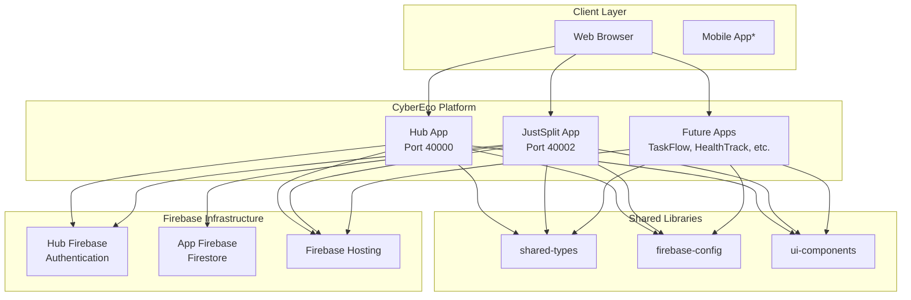
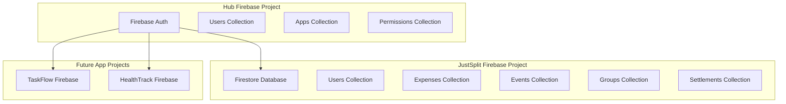
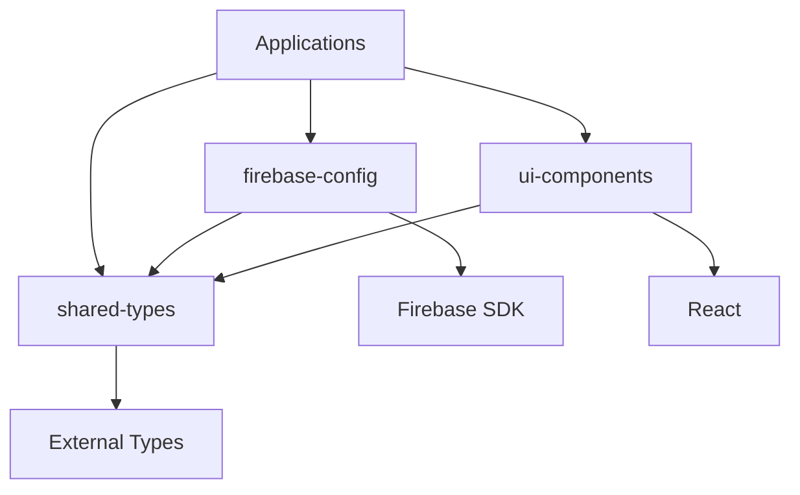

# CyberEco Platform Architecture Overview

> **🌿 CyberEco Vision**: Building a human-centered digital ecosystem for conscious, connected, and sustainable living through modular, interoperable applications.

> **📋 Documentation Update**: This document provides the original platform overview. For updated NX monorepo architecture documentation, see [**NX Monorepo Architecture**](./nx-monorepo-architecture.md).

## 🏗️ System Architecture

CyberEco is a comprehensive human-centered digital ecosystem built as an NX monorepo. The platform follows a microservices-like architecture where each application serves a specific domain while sharing common infrastructure, authentication, and core values of digital sovereignty, wellbeing by design, and community connection.

## 🎯 Design Principles

### 1. **Human-Centered Modular Architecture**
- **Digital Sovereignty**: Each app respects user autonomy and data ownership
- **Wellbeing by Design**: Technology that enhances rather than exploits human attention
- **Separation of Concerns**: Each app handles a specific domain while promoting holistic living
- **Shared Values**: Common ethical framework and user-centric design principles
- **Independent Yet Connected**: Apps can operate independently while fostering meaningful connections

### 2. **Conscious Technology Monorepo**
- **NX Workspace**: Advanced build system optimized for sustainable development practices
- **Mindful Code Sharing**: Shared types, components, and utilities that promote consistency
- **Incremental Evolution**: Only rebuild what changed, minimizing computational waste
- **Community Contribution**: Architecture designed for collaborative development

### 3. **Open and Transparent Backend**
- **Multi-Project Setup**: Separate Firebase projects promoting data sovereignty
- **Unified Authentication**: Central auth system respecting privacy and user choice
- **Sustainable Architecture**: Serverless design minimizing environmental impact
- **Future-Ready**: Designed for eventual decentralized transition

### 4. **Holistic Developer Experience**
- **TypeScript**: Type safety promoting code reliability and trust
- **Rapid Iteration**: Fast development cycles for responsive community needs
- **Comprehensive Testing**: Quality assurance aligned with platform values
- **Living Documentation**: Docs that evolve with community input and platform growth

## 🌐 High-Level Architecture



## 📱 Application Architecture

### Hub Application
**Purpose**: Central authentication and application launcher

```
Hub App (Next.js 15)
├── Authentication (Firebase Auth)
├── User Profile Management
├── App Discovery & Navigation
├── Permission Management
└── Shared Context Providers
```

**Key Responsibilities**:
- User authentication (login/logout/registration)
- Token generation and validation
- Application launcher interface
- User profile and settings management
- Cross-app permission management

### JustSplit Application
**Purpose**: Comprehensive expense splitting and financial management

```
JustSplit App (Next.js 15)
├── Expense Management
├── Group Management
├── Event Management
├── Settlement Calculations
├── Currency Conversion
├── Data Visualization
└── CSV Export
```

**Key Responsibilities**:
- Expense tracking and splitting
- Group and event management
- Real-time currency conversion
- Settlement calculations
- Financial dashboards and analytics
- Data export functionality

## 🗄️ Data Architecture

### Firebase Multi-Project Setup



### Data Flow Pattern

1. **Authentication Flow**:
   ```
   User → Hub App → Firebase Auth → JWT Token
   ```

2. **Cross-App Access**:
   ```
   User → App → Verify Token (Hub) → Access Resources
   ```

3. **Data Operations**:
   ```
   App → Firebase SDK → Firestore → Real-time Updates
   ```

## 🔧 Technology Stack

### Frontend Stack
```yaml
Framework: Next.js 15 (App Router)
Language: TypeScript
Styling: CSS Modules
State Management: React Context API
Build System: NX with Webpack/Turbopack
Testing: Jest + React Testing Library
```

### Backend Stack
```yaml
Database: Firebase Firestore
Authentication: Firebase Auth
Hosting: Firebase Hosting
Functions: Firebase Cloud Functions*
Storage: Firebase Storage*
```

### Development Tools
```yaml
Monorepo: NX Workspace
Package Manager: npm
Linting: ESLint + Prettier
Version Control: Git
CI/CD: GitHub Actions
Deployment: Firebase CLI
```

## 📦 Library Architecture

### Shared Libraries Structure

```
libs/
├── shared-types/           # TypeScript definitions
│   ├── auth.ts            # Authentication types
│   ├── user.ts            # User-related types
│   ├── app.ts             # Application types
│   └── index.ts           # Export barrel
├── firebase-config/        # Firebase utilities
│   ├── auth.ts            # Auth helpers
│   ├── config.ts          # Configuration
│   ├── firestore.ts       # Firestore helpers
│   └── index.ts           # Export barrel
└── ui-components/          # Shared UI components
    ├── Alert.tsx          # Alert component
    ├── Button.tsx         # Button component
    ├── Card.tsx           # Card component
    ├── LoadingSpinner.tsx # Loading component
    └── index.ts           # Export barrel
```

### Library Dependencies



## 🔐 Security Architecture

### Authentication Flow
1. **User Registration/Login** → Hub Application
2. **Token Generation** → Firebase Auth (Hub Project)
3. **Token Verification** → Individual Apps
4. **Resource Access** → App-specific Firebase Projects

### Security Layers
- **Client-Side**: Firebase Auth SDK token validation
- **Database**: Firestore security rules
- **API**: Cloud Functions with token verification
- **Network**: HTTPS everywhere, CORS policies

### Permission Model
```
Hub User (Firebase Auth)
├── App Permissions
│   ├── JustSplit: [read, write, admin]
│   ├── TaskFlow: [read]
│   └── HealthTrack: [read, write]
└── Profile Data
    ├── Display Name
    ├── Email
    ├── Avatar
    └── Preferences
```

## 🚀 Deployment Architecture

### Firebase Hosting Strategy
```
Firebase Projects:
├── cybereco-hub          # Hub app + Authentication
├── cybereco-justsplit    # JustSplit app + data
├── cybereco-taskflow     # Future: TaskFlow app + data
└── cybereco-shared       # Shared resources (optional)
```

### Environment Strategy
```
Environments:
├── Development
│   ├── Local (emulators)
│   └── Dev Firebase projects
├── Staging
│   └── Staging Firebase projects
└── Production
    └── Production Firebase projects
```

## 📊 Performance Architecture

### Build Optimization
- **NX Caching**: Aggressive build and test caching
- **Tree Shaking**: Remove unused code
- **Code Splitting**: Route-based and component-based splitting
- **Bundle Analysis**: Regular bundle size monitoring

### Runtime Optimization
- **Firebase Caching**: Offline-first with Firestore caching
- **CDN**: Firebase Hosting global CDN
- **Image Optimization**: Next.js built-in optimization
- **Lazy Loading**: Component and route lazy loading

### Monitoring
- **Firebase Analytics**: User behavior tracking
- **Performance Monitoring**: Core Web Vitals
- **Error Tracking**: Client-side error reporting
- **Usage Metrics**: Feature usage analytics

## 🔮 Future Architecture Considerations

### Scalability Plans
- **Microservices**: Potential migration to independent services
- **API Gateway**: Centralized API management
- **Message Queues**: Event-driven communication
- **Caching Layer**: Redis or similar for performance

### Technology Evolution
- **Framework Updates**: Regular Next.js updates
- **Database Scaling**: Potential multi-region setup
- **Mobile Apps**: React Native with shared business logic
- **Desktop Apps**: Electron or Tauri applications

---

This architecture provides a solid foundation for the CyberEco platform while maintaining flexibility for future growth and evolution.