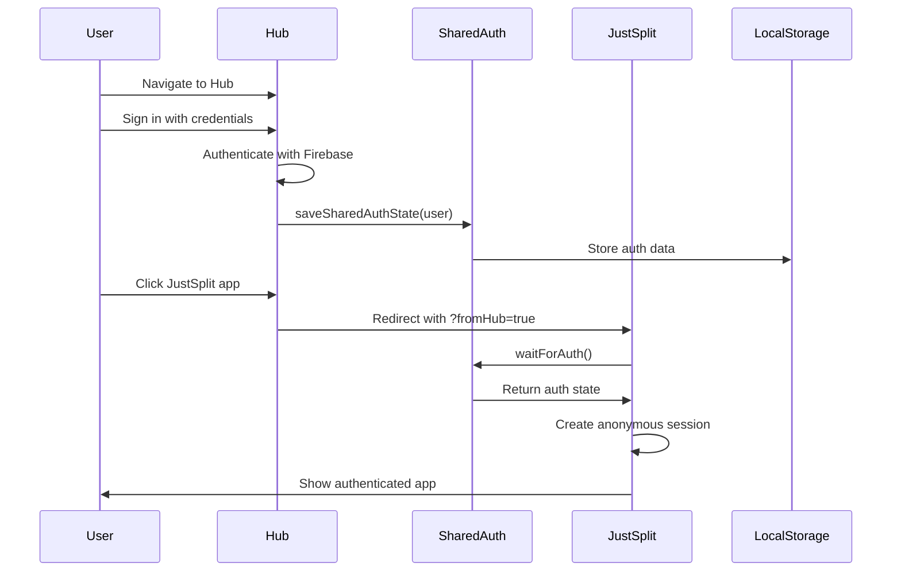
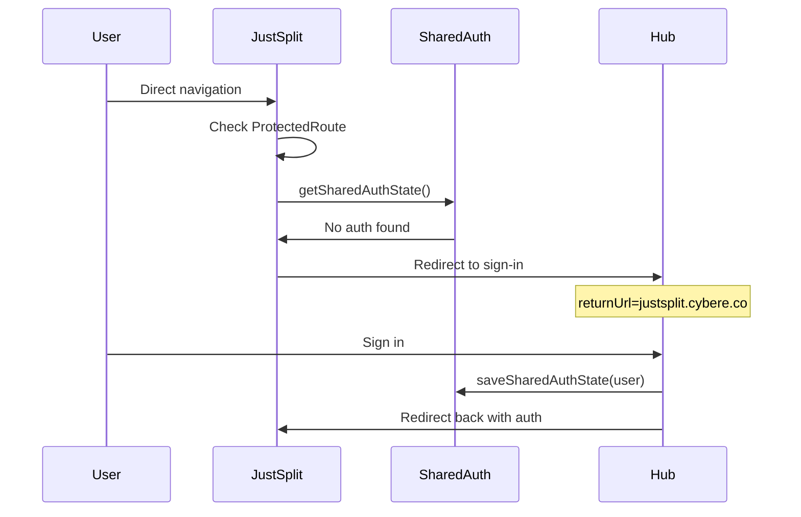
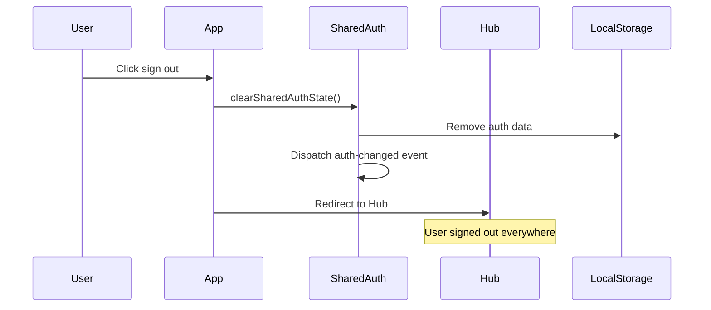

# CyberEco Single Sign-On (SSO) Architecture

## Overview

The CyberEco ecosystem implements a centralized Single Sign-On (SSO) system where the Hub acts as the primary authentication provider for all ecosystem applications. This architecture allows users to sign in once at the Hub and seamlessly access all authorized applications without re-authentication.

## Architecture Components

### 1. Hub (Authentication Provider)
- **Location**: `apps/hub/`
- **Port**: 40000 (development)
- **Role**: Central authentication authority
- **Key Components**:
  - `AuthContext.tsx` - Manages authentication state and saves to shared storage
  - Sign-in/Sign-up pages - User authentication flows
  - App launcher - Redirects to apps with authentication context

### 2. Shared Authentication State Library
- **Location**: `libs/auth/src/shared-auth-state.ts`
- **Purpose**: Cross-app authentication state sharing
- **Key Functions**:
  - `saveSharedAuthState()` - Persists auth data to localStorage
  - `getSharedAuthState()` - Retrieves current auth state
  - `waitForAuth()` - Async helper for auth state availability
  - `subscribeToAuthStateChanges()` - Real-time auth state updates

### 3. Application Integration (JustSplit Example)
- **Location**: `apps/justsplit/`
- **Port**: 40002 (development)
- **Key Components**:
  - `JustSplitAuthContext.tsx` - Checks for Hub authentication
  - `ProtectedRoute.tsx` - Enforces authentication requirements
  - Anonymous session creation for development

## Authentication Flow

### 1. Initial Sign-In Flow



### 2. Direct App Access Flow



### 3. Sign-Out Flow



## Implementation Details

### Shared Auth State Structure

```typescript
interface SharedAuthUser {
  uid: string;
  email: string | null;
  displayName: string | null;
  photoURL: string | null;
  emailVerified: boolean;
}

interface SharedAuthState {
  user: SharedAuthUser | null;
  token: string | null;
  timestamp: number;
}
```

### Storage Mechanism

- **Key**: `cybereco-shared-auth`
- **Storage**: localStorage (cross-port accessible)
- **Expiration**: 24 hours
- **Events**: Custom events for cross-tab synchronization

### Development vs Production

#### Development (localhost)
- Uses localStorage for cross-port authentication
- Works around Firebase Auth emulator limitations
- Creates anonymous sessions with Hub user metadata
- Requires explicit `?fromHub=true` parameter

#### Production (subdomains)
- Uses Firebase Auth with custom domains
- Cookies shared across `*.cybere.co` subdomains
- Direct Firebase Auth session sharing
- No anonymous session workarounds needed

## Security Considerations

### 1. Token Security
- Auth state includes timestamp for expiration
- 24-hour validity window
- No sensitive tokens in localStorage (development only)

### 2. Cross-Origin Security
- Validate origin domains in production
- Use secure, httpOnly cookies for production
- Implement CSRF protection

### 3. Session Management
- Clear shared state on sign-out
- Synchronize across tabs/windows
- Handle stale sessions gracefully

## Error Handling

### Common Issues and Solutions

1. **Redirect Loop**
   - Cause: ProtectedRoute redirecting before auth context initializes
   - Solution: Added auth check delays and proper state management

2. **Auth State Not Found**
   - Cause: Timing issue between Hub save and app read
   - Solution: `waitForAuth()` with 5-second timeout

3. **Firebase Emulator Limitations**
   - Cause: Auth doesn't persist across different ports
   - Solution: Shared auth state via localStorage

## Testing Strategy

### Unit Tests
- Test shared auth state functions
- Mock localStorage and window events
- Verify expiration logic

### Integration Tests
- Test Hub → App authentication flow
- Test direct app access → Hub redirect
- Test sign-out synchronization

### E2E Tests
- Full user journey from sign-in to app access
- Multi-tab synchronization
- Session expiration handling

## API Reference

### saveSharedAuthState(user, token?)
Saves authentication state to shared storage.

```typescript
saveSharedAuthState({
  uid: 'user123',
  email: 'user@example.com',
  displayName: 'John Doe',
  photoURL: null,
  emailVerified: true
});
```

### getSharedAuthState()
Retrieves current authentication state.

```typescript
const authState = getSharedAuthState();
if (authState?.user) {
  console.log('User authenticated:', authState.user.email);
}
```

### waitForAuth(timeout?)
Waits for authentication state to become available.

```typescript
const authState = await waitForAuth(5000); // 5 second timeout
if (authState?.user) {
  // Process authenticated user
}
```

### clearSharedAuthState()
Removes authentication state from storage.

```typescript
clearSharedAuthState();
// User is now signed out across all apps
```

### subscribeToAuthStateChanges(callback)
Subscribes to authentication state changes.

```typescript
const unsubscribe = subscribeToAuthStateChanges((state) => {
  if (state?.user) {
    console.log('User signed in:', state.user.email);
  } else {
    console.log('User signed out');
  }
});

// Later: unsubscribe();
```

## Future Enhancements

1. **Token-Based Authentication**
   - Implement JWT tokens for production
   - Secure token refresh mechanism
   - Token validation endpoints

2. **Session Management Service**
   - Centralized session tracking
   - Device management
   - Active session monitoring

3. **Enhanced Security**
   - Implement OAuth2/OIDC
   - Multi-factor authentication
   - Biometric authentication support

4. **Performance Optimizations**
   - Cache auth state in memory
   - Reduce localStorage access
   - Implement service workers for offline auth